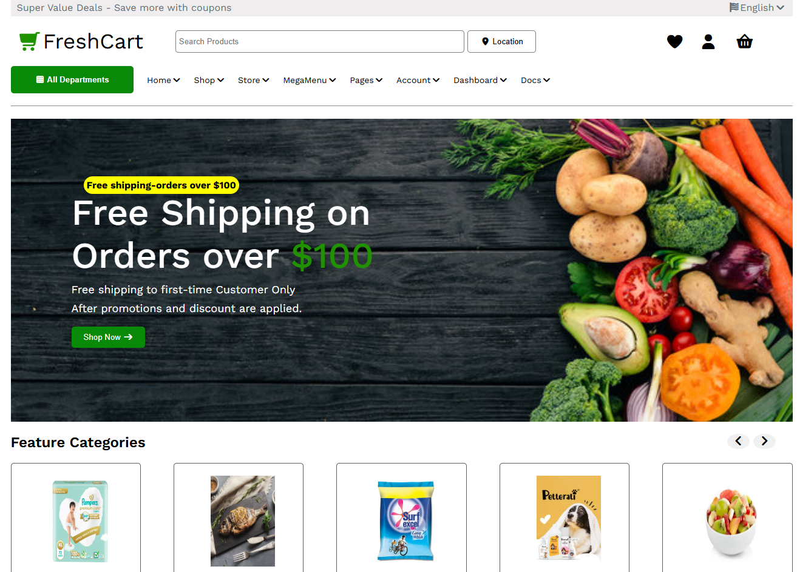

# 🛒 FreshCart - E-Commerce Grocery Website

A modern and responsive **FreshCart E-Commerce Grocery Website** built using **HTML5** and **CSS3**. This project features an attractive online grocery shopping interface with product categories, promotional banners, featured products, responsive navigation, and a clean user experience.

## 🚀 Live Demo

🔗 https://your-live-demo-link.com

> Replace the above link with your GitHub Pages, Netlify, or Vercel deployment URL.

---

## ✨ Features

- 🏠 Responsive Homepage
- 🔍 Product Search Bar
- 📍 Location Selector
- 🛒 Shopping Cart, Wishlist & User Icons
- 📂 Category Navigation Menu
- 🎯 Hero Banner with Promotional Offers
- 🥬 Featured Categories
- 🔥 Popular Products Section
- 💰 Product Discounts & Sale Badges
- ⭐ Product Ratings
- ➕ Add to Cart Buttons
- 🎁 Promotional Banners
- 🚚 Service Features Section
- 📱 Fully Responsive Layout
- 🎨 Modern & Clean UI

---

## 🛠️ Technologies Used

- HTML5
- CSS3
- Font Awesome Icons
- Google Fonts (Work Sans)

---

## 📂 Project Structure

```text
FreshCart/
│
├── css/
│   ├── style.css
│   ├── font.css
│   └── all.min.css
│
├── images/
│
├── index.html
└── README.md
```

---

## 📸 Screenshots




---

## 🚀 Getting Started

### Clone the Repository

```bash
git clone https://github.com/tushi66/FreshCart.git
```

### Navigate to the Project

```bash
cd FreshCart
```

### Run the Project

Open `index.html` in your preferred web browser.

---

## 🎯 Main Sections

- Top Information Bar
- Responsive Navigation Menu
- Hero Banner
- Featured Categories
- Promotional Offers
- Popular Products
- Product Cards
- Service Highlights
- Footer with Categories & Links
- Social Media Icons

---

## 📱 Responsive Design

Optimized for:

- 💻 Desktop
- 📱 Tablet
- 📲 Mobile

---

## 🔮 Future Improvements

- JavaScript Product Search
- Shopping Cart Functionality
- Wishlist
- User Authentication
- Product Details Page
- Product Filtering & Sorting
- Backend Integration
- Checkout System
- Payment Gateway
- Order Tracking
- Dark Mode

---

## 👨‍💻 Author

**Tushar Patel**

- GitHub: https://github.com/tushi66

---

## ⭐ Support

If you found this project useful, please give it a ⭐ on GitHub.

---

## 📄 License

This project is for learning and portfolio purposes only.

---

Made with ❤️ by **Tushar Patel**
